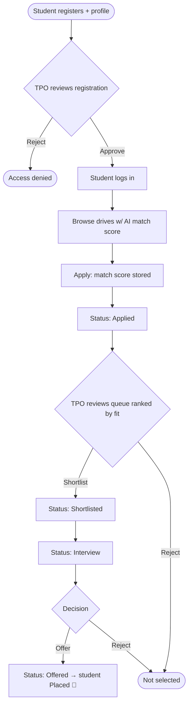
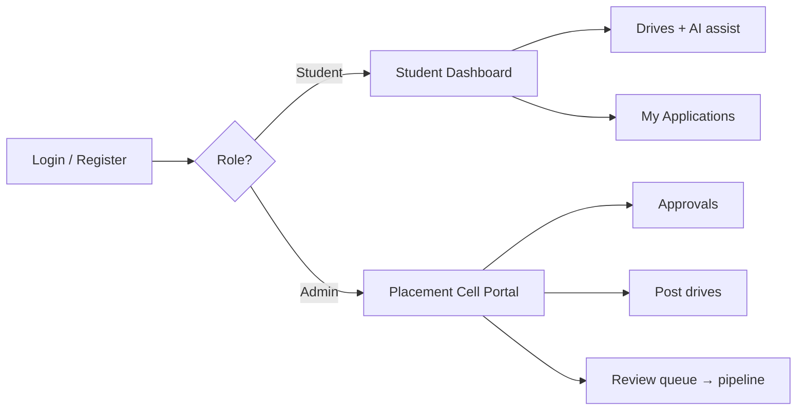

# PlaceIQ — AI-Powered Placement Management Platform

> **Day 3 — Product Development Simulation** · Xebia Internship Program
>
> Problem statement: **"AI-Powered Placement Management Platform."** This repo is both the **product deliverables** (Stakeholder Analysis, User Stories, PRD, Feature Prioritization, Wireframes) *and* a working full-stack **MERN** MVP that implements them.

**Live**
- Frontend: https://xebia-placeiq.dhruvgoyal.tech
- Backend: https://xebia-ai-powered-placement-manageme.vercel.app/
- Repo: https://github.com/DhruvGoyal404/Xebia_aiPowered_Placement_Management_Platform

**Built as a team** for the Day 3 Product Development Simulation:
- Dhruv Goyal — [@DhruvGoyal404](https://github.com/DhruvGoyal404)
- Sakshham Bhagat — [@SakshhamTheCoder](https://github.com/SakshhamTheCoder)
- Ujjwal Dalal — [@ujjwaldalal7](https://github.com/ujjwaldalal7)
- Arvin Saini — [@ArvinSaini](https://github.com/ArvinSaini)
- Jeevant Verma — [@JeevantVerma](https://github.com/JeevantVerma)

---

## The thinking

Every campus runs the same broken placement loop: companies and drives are announced over scattered notices and WhatsApp groups, students apply blindly to roles they aren't eligible for, the placement cell tracks everything in spreadsheets, and nobody knows *who is a good fit for what*. Two problems are real and personal as a student at TIET:

1. **Blind applications.** Students apply everywhere because there's no signal for *fit*. Recruiters drown in irrelevant applications.
2. **No single source of truth.** Drives, applications, shortlists and offers live in five different places.

**PlaceIQ** solves both. The **management** half is a clean placement loop — drives → applications → a hiring pipeline (applied → shortlisted → interview → offer). The **AI** half adds the missing *fit signal*: a transparent 0–100 **match score** on every drive, **skill-gap** analysis, **interview prep**, and **resume feedback**.

The key design decision: **the match score is computed objectively from the student's own profile** (skills, CGPA, branch) against each drive's requirements — so it's explainable, never a black box, and ranks the recruiter's queue by genuine fit.

> Built as Day 3, it deliberately **reuses and hardens the auth + UI foundation** from Day 1 (User Management Portal) and Day 2 (InternQuest): admin-approval gate, JWT + bcrypt, Cloudinary profile pics, approval emails, and the same Tailwind dark-mode design system.

---

## 1. Stakeholder Analysis

| Stakeholder | Interest (what they want) | Influence | Key needs from PlaceIQ |
|---|---|---|---|
| **Student** | Land a good role with minimum wasted effort | High (primary user) | See where they fit, apply fast, track status, improve weak spots |
| **Placement Officer / TPO** (admin) | High placement rate, smooth process, clean reporting | High (decision maker) | Post drives, approve students, run the pipeline, see analytics |
| **Recruiter / Company** | Quality, eligible, ranked applicants | High (demand side) | Eligibility-filtered, fit-ranked applications (modeled as drive fields + match scoring) |
| **Faculty mentor** | Students' growth & readiness | Medium | Visibility into skill gaps and progress |
| **College administration** | Institutional reputation & metrics | Medium | Placement rate, offers made, funnel health |

**Primary users built in this MVP:** Student and Placement Officer (Admin). Recruiter/company is modeled as structured data on each drive (company, role, eligibility, required skills) with the TPO acting on the company's behalf — a deliberate scope choice consistent with Day 1/2's two-role pattern.

---

## 2. User Stories

**Epic A — Onboarding & Auth**
- As a **student**, I want to register with my academic profile (branch, CGPA, skills, resume) so that the platform can score my fit. *AC: registration creates a pending request; I can't log in until approved.*
- As a **TPO**, I want to approve/reject registrations so that only genuine cohort students get access. *AC: approval flips the account active and emails the student a login link.*

**Epic B — Drive Management**
- As a **TPO**, I want to post drives with company, role, required skills, CGPA cutoff and eligible branches so that students see accurate, structured openings. *AC: create/edit/delete; deleting a drive removes its applications.*

**Epic C — Applications & Pipeline**
- As a **student**, I want to apply to a drive in one click so that my match score is recorded. *AC: one application per drive; score stored at apply time.*
- As a **TPO**, I want a review queue ranked by match score so that I can shortlist the best fits first. *AC: advance applied → shortlisted → interview → offer/reject with feedback; an offer marks the student "placed".*
- As a **student**, I want to track each application's live status so that I always know where I stand.

**Epic D — AI Assist**
- As a **student**, I want a 0–100 match score per drive so that I apply where I stand out. *AC: score = 60% skill overlap + 20% CGPA eligibility + 20% branch eligibility.*
- As a **student**, I want skill-gap analysis, interview prep and resume feedback so that I can improve my odds. *AC: works without an AI key via deterministic fallbacks; richer when Claude is configured.*

**Epic E — Analytics**
- As a **TPO**, I want a dashboard of students, applications, offers and placement rate so that I can report cohort health at a glance.

---

## 3. Product Requirement Document (PRD)

**Objective.** Give students an explainable *fit signal* and a single place to manage the placement journey, while giving the placement cell a structured drive→offer pipeline with analytics.

**Personas.** (1) *Aarav*, final-year CSE student, strong full-stack skills, wants targeted applications. (2) *Ms. Rao*, placement officer, runs 40+ drives a season and needs ranked, eligible applicants and clean numbers.

**Functional requirements (in scope, built):**
- Email/password auth, 2 roles (student, admin), role-based routing + server-side access control.
- Student registration with **admin approval gate**; account activate/deactivate; create admin.
- Placement profile (branch, CGPA, skills, resume) editable by the student.
- Drive authoring (create/edit/delete) by the TPO with eligibility + required skills.
- Application lifecycle: apply → shortlist → interview → offer/reject, with feedback; one application per drive; withdraw before a decision.
- **AI engine:** deterministic match scoring + skill-gap; optional Claude enrichment for fit narrative, interview prep, resume feedback.
- Admin analytics dashboard (students, active, placed, placement rate, applications, offers).

**Non-functional requirements:**
- **Security:** JWT (7-day expiry), bcrypt hashing (salt 10), role middleware on every protected route, 401 auto-logout.
- **Reliability:** AI/Cloudinary/email are all optional and **gracefully no-op** — the demo never breaks without keys.
- **Performance:** match scores precomputed into drive listings (no extra round-trips); MongoDB indexes incl. a unique `(drive, student)`.
- **Usability:** responsive Tailwind UI, light/dark theme, toasts, route guards.

**Success metrics:** application-to-eligible ratio (are students applying where they fit?), shortlist→offer conversion, time-to-fill per drive, and overall **placement rate**.

**Out of scope (future):** separate recruiter logins, resume file parsing/OCR, automated assessments, interview scheduling/calendar, SSO, notifications.

---

## 4. Feature Prioritization (MoSCoW)

| Feature | Priority | In MVP? |
|---|---|---|
| Auth + admin approval gate | **Must** | ✅ |
| Student placement profile | **Must** | ✅ |
| Drive CRUD (TPO) | **Must** | ✅ |
| Apply + application pipeline | **Must** | ✅ |
| Deterministic match score (0–100) | **Must** | ✅ |
| Admin analytics dashboard | **Should** | ✅ |
| Skill-gap analysis | **Should** | ✅ |
| AI interview prep | **Should** | ✅ |
| AI resume feedback | **Should** | ✅ |
| Light/dark theme, toasts | **Should** | ✅ |
| Claude-enriched narratives | **Could** | ✅ (optional key) |
| Separate recruiter login | **Won't** (this cycle) | ❌ |
| Resume file parsing, assessments, scheduling | **Won't** (this cycle) | ❌ |

---

## 5. Wireframes

**Student — Drive card (with AI match)**
```
+-----------------------------------------------------+
| [full-time] [12 LPA] [Gurugram]              ┌─────┐ |
| Software Engineer                            │ 85  │ |
| Xebia                                        │match│ |
|                                              └─────┘ |
| Full-stack MERN role building products…             |
| [JavaScript] [React] [Node.js] [~~MongoDB~~]        |
| Min CGPA 7                                          |
| [ Apply ]  [✨ Fit] [🧭 Skill gap] [💬 Interview]   |
+-----------------------------------------------------+
```

**Student — My Applications (pipeline)**
```
+-----------------------------------------------------+
| Software Engineer · Xebia        85 match  [Offer 🎉]|
| Frontend Engineer · PixelWorks   72 match  [Interview]|
| Data Analyst · DataForge         63 match  [Applied] |
+-----------------------------------------------------+
```

**Admin — Review queue (ranked by fit)**
```
+-----------------------------------------------------+
| aarav applied to Software Engineer · Xebia          |
| CSE · CGPA 8.6 · JS, React, Node      88 match [App.]|
| Feedback:[ strong fundamentals    ]                 |
| [Shortlist] [→ Interview] [Offer] [Reject]          |
+-----------------------------------------------------+
```

**Admin — Overview**
```
+----------+----------+----------+-----------------+
| Students | Active   | Placed   | Placement rate  |
|    7     |    5     |    1     |      20%        |
+----------+----------+----------+-----------------+
| Pending  | Drives   | Apps     | Offers made     |
|    2     |    4     |    8     |       1         |
+----------+----------+----------+-----------------+
```

---

## 6. Workflow diagrams

**Application lifecycle (core loop):**


**Role-based entry:**


---

## The AI engine (hero feature — hybrid)

**Deterministic core (`backend/utils/aiMatch.js`)** — pure, testable functions, no IO:
- `computeMatch(student, drive)` → `{ score, skillsMatched, skillsMissing, cgpaEligible, branchEligible }`.
- Score = **60% skill overlap + 20% CGPA eligibility + 20% branch eligibility**, rounded to 0–100. Always available, demo-safe.

**Optional Claude enrichment (`backend/utils/aiClient.js`)** — mirrors the Cloudinary/mailer "optional integration" pattern. When `ANTHROPIC_API_KEY` is set it uses `@anthropic-ai/sdk` (model `claude-haiku-4-5`, with prompt caching) to generate the *narrative* parts; when it's absent (or a call fails) every function **falls back to a deterministic template** so nothing breaks.

This is the **hybrid** design: scores are always objective and reproducible; AI only enriches the prose.

---

## Tech stack

**Frontend:** React 18 (CRA), React Router v6, Tailwind CSS v3 (class-based dark mode), Axios (JWT interceptor + 401 auto-logout), Context API, react-hot-toast.
**Backend:** Node.js + Express, MongoDB + Mongoose, JWT, bcryptjs, optional Cloudinary (profile pics), optional Nodemailer (approval emails), optional Anthropic SDK (AI enrichment).
**Deployment:** Vercel (two projects — backend & frontend), MongoDB Atlas, custom domain.

## Project structure
```
xebia_day3/
├── backend/
│   ├── config/db.js
│   ├── models/        # User, RegistrationRequest, Drive, Application
│   ├── middleware/auth.js
│   ├── utils/         # aiMatch (engine), aiClient (Claude), cloudinary, mailer
│   ├── controllers/   # auth, admin, drive, application, ai
│   ├── routes/        # auth, admin, drives, applications, ai
│   ├── seed.js        # default admin + starter drives
│   ├── seed-demo.js   # rich demo across all 4 collections
│   └── server.js
└── frontend/
    └── src/
        ├── context/   # AuthContext, ThemeContext
        ├── components/# Navbar, RouteGuards, ThemeToggle, ui (Tailwind primitives)
        ├── utils/     # axiosConfig, fileToBase64
        └── pages/     # Landing, Login, Register, admin/AdminDashboard, student/StudentDashboard
```

## Getting started

**1. Backend**
```bash
cd backend
npm install
cp .env.example .env     # fill MONGODB_URI + JWT_SECRET (ANTHROPIC_API_KEY optional)
npm run seed             # default admin + starter drives
npm run dev              # http://localhost:5000
```

**2. Frontend**
```bash
cd frontend
npm install
# .env.local:  REACT_APP_API_URL=http://localhost:5000
npm start                # http://localhost:3000
```

**Default admin** (`npm run seed`): `admin@placeiq.com` / `Admin@123` — change after first login.

**Populated demo:** `npm run seed:demo` fills all four collections with students (varied skills/CGPA), drives and applications spread across the pipeline (so match scores, the review queue and analytics are non-empty). ⚠️ It wipes those collections first. Seeded students use password `student123`.

## API overview

| Method | Endpoint | Access | Purpose |
|---|---|---|---|
| POST | `/api/auth/register` | public | Student registration (pending approval) |
| POST | `/api/auth/login` | public | Login → JWT |
| GET | `/api/auth/me` | auth | Current user + profile |
| PUT | `/api/auth/profile` | student | Update placement profile |
| GET | `/api/admin/pending-requests` … `/dashboard-stats` | admin | Approvals, users, analytics |
| GET/POST/PUT/DELETE | `/api/drives` (+`/:id`) | auth/admin | List (students get match + status) / CRUD |
| POST | `/api/applications` | student | Apply (stores match score) |
| GET | `/api/applications/mine` | student | My applications |
| DELETE | `/api/applications/:id` | student | Withdraw |
| GET | `/api/applications?status=` | admin | Review queue / all (ranked by fit) |
| PATCH | `/api/applications/:id/review` | admin | Advance pipeline + feedback |
| GET | `/api/ai/match/:driveId` | student | Fit score + analysis |
| GET | `/api/ai/interview-prep/:driveId` | student | Interview questions + tips |
| GET | `/api/ai/skill-gap/:driveId` | student | Missing skills + advice |
| POST | `/api/ai/resume-feedback` | student | Resume suggestions |

## Deployment (Vercel — two projects)

Both deploy from the same repo with different **Root Directory**.
- **Backend** → Root `backend`, Framework *Other*. Env: `MONGODB_URI`, `JWT_SECRET`, `JWT_EXPIRES_IN`, `CLIENT_URL`, `CLIENT_LOGIN_URL`, `NODE_ENV=production`, optional `ANTHROPIC_API_KEY` / `AI_MODEL`, optional `CLOUDINARY_*`, optional `MAIL` / `MAIL_PASSWORD`.
- **Frontend** → Root `frontend`, Framework *Create React App*. Env: `REACT_APP_API_URL` = deployed backend URL.
- **MongoDB Atlas** → Network Access → allow `0.0.0.0/0` for Vercel.

---

_Built for the Xebia Internship Program — Day 3._
